# Cyber Security Labs — Browser Security

**Student:** Sofia Hunkalo  
**Course:** Основи кібербезпеки в розробці ПЗ  

A series of 5 hands-on labs exploring browser security mechanisms using a simulated WebMail application built with Node.js/Express.

## Architecture

The project simulates a multi-origin web ecosystem:

| Server | Port | Role |
|--------|------|------|
| GoodHost | 3000 | Main WebMail application |
| StaticHost (CDN) | 8001 | Static assets (JS, CSS, images) |
| TrustCo (Partner) | 4000 | Support chat widget |
| WeatherApp (Utility) | 8002 | Weather widget / Attacker |
| Proxy | 8080 | MitM proxy (Lab 5 only) |

---

## Lab 1 — Browser Security Foundations

**Concept:** Same-Origin Policy (SOP) and CORS

### Task 5 — Default Mode: CORS Errors
The browser blocks cross-origin fetch requests by default (Same-Origin Policy).  
`support.js` from port 4000 cannot fetch data from port 3000 without CORS headers.

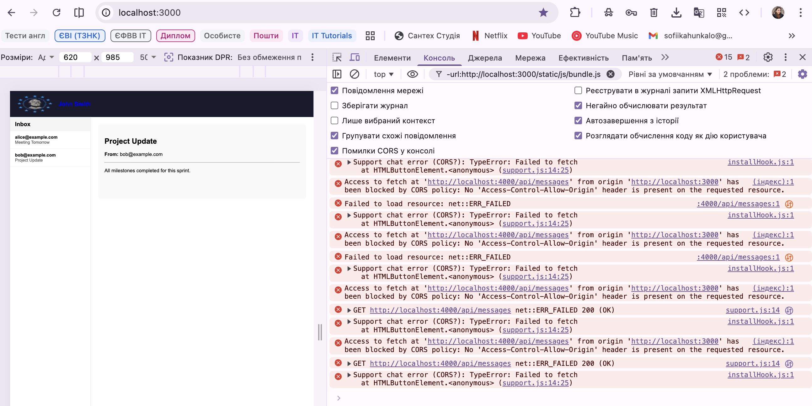

### Task 6 — Mode1: CORS Fixed
Adding `cors()` middleware to the servers allows cross-origin communication.  
All external scripts load successfully and the Support Chat works.

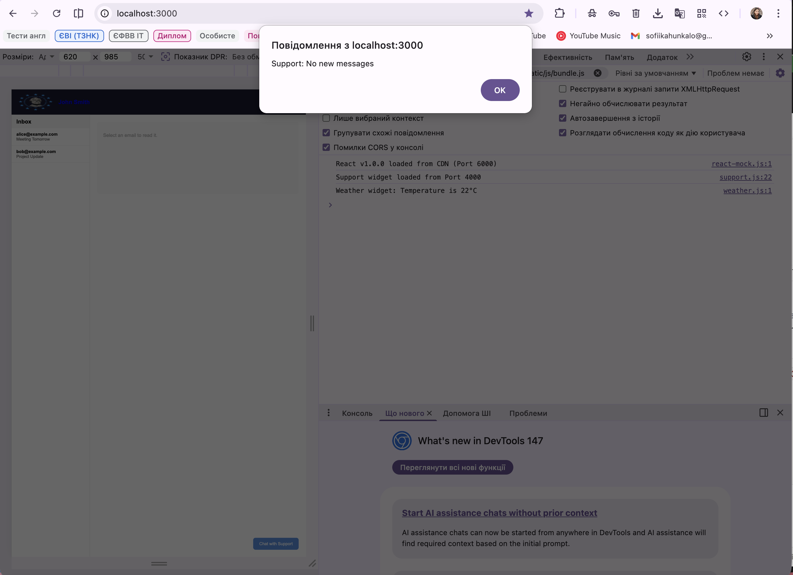

### Task 7 — Malicious WeatherApp (XSS)
WeatherApp switched to `breach1` mode executes a malicious script that reads  
`document.cookie` and `innerHTML` — demonstrating XSS via third-party script trust.

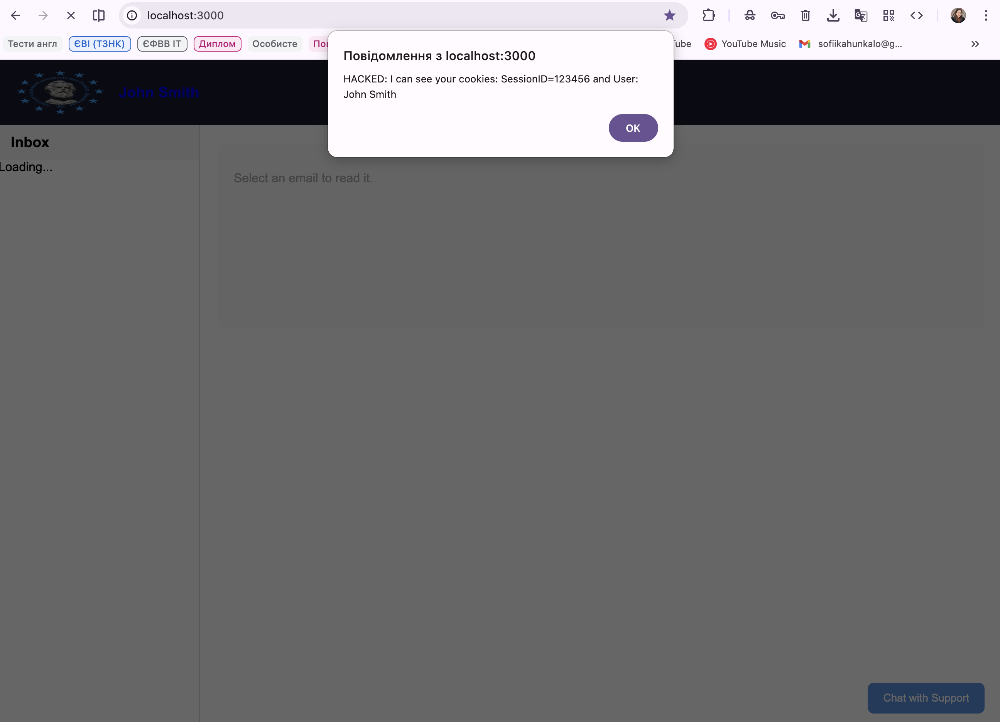

---

## Lab 2 — Content Security Policy (CSP)

**Concept:** Using HTTP headers to restrict which resources the browser may load.

### Task 1 — CSP Strict (`default-src 'self'`)
All external resources are blocked — scripts, styles, images from other origins.  
Maximum security breaks all third-party integrations.

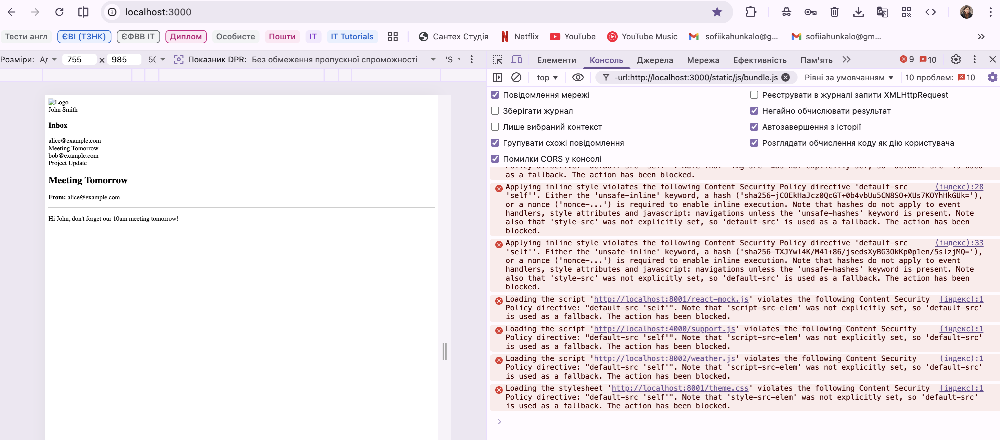

### Task 2 — CSP Balanced
A granular policy allows trusted origins (4000, 8001) while blocking the malicious  
WeatherApp (8002). Even with WeatherApp in `breach1` mode, the alert never fires.

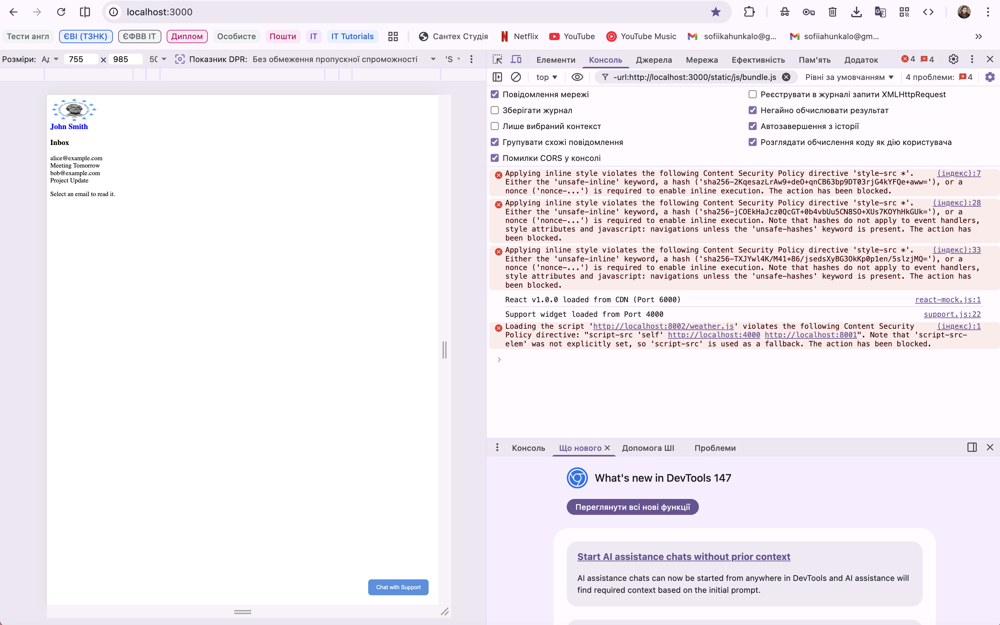

---

## Lab 3 — Supply Chain Security & SRI

**Concept:** Subresource Integrity (SRI) — cryptographic hash verification of scripts.

### Task 1 — CDN Breach (No SRI)
The CDN is compromised — `react-mock.js` returns a malicious alert.  
CSP cannot detect this because port 8001 is trusted. The alert fires.

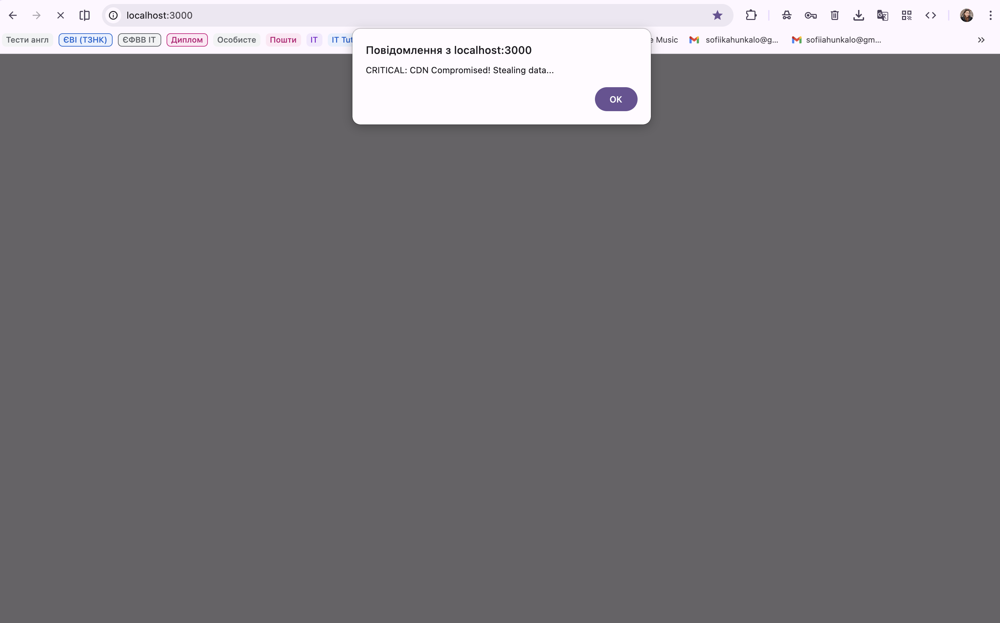

### Task 2 — SRI Active (Breach Blocked)
Adding `integrity="sha256-..."` to the script tag causes the browser to verify  
the file hash. The compromised script hash does not match — it is blocked.

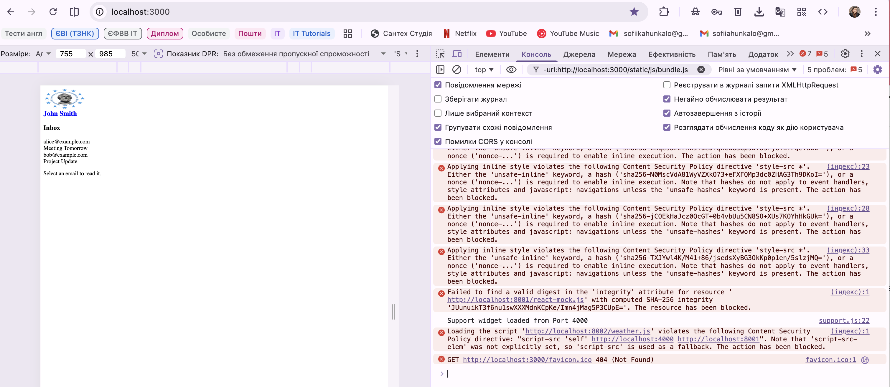

### Task 3 — SRI with Version Update
Updating the CDN to `v1.0.1` (a legitimate change) breaks the app until  
the `integrity` hash is updated. SRI enforces disciplined version management.

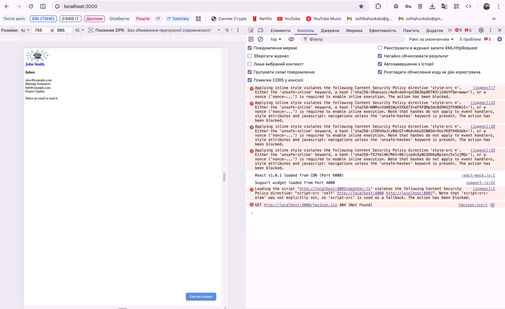

---

## Lab 4 — Session Management & Cookie Security

**Concept:** Cookie security flags and their effect on session token protection.

### Task 1 — Naive Cookie
Cookie set without any flags. `document.cookie` exposes the session token to JavaScript.

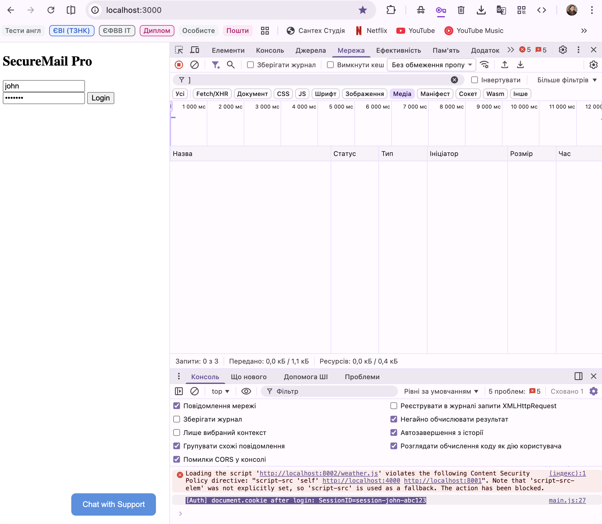

### Task 2 — Silent Cookie Theft
WeatherApp in `breach2` mode silently exfiltrates the cookie via `fetch()`.  
The stolen `SessionID` appears in the attacker's server terminal — no visible alert.

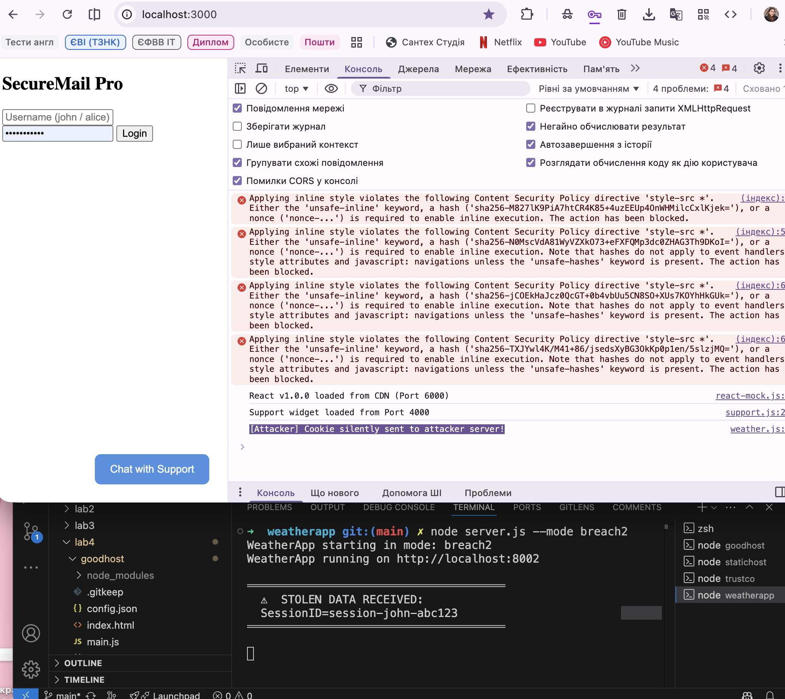

### Task 3 — HttpOnly Flag
`HttpOnly` hides the cookie from `document.cookie`. JavaScript returns empty string.  
The attacker's `fetch()` sends nothing useful — theft is prevented.

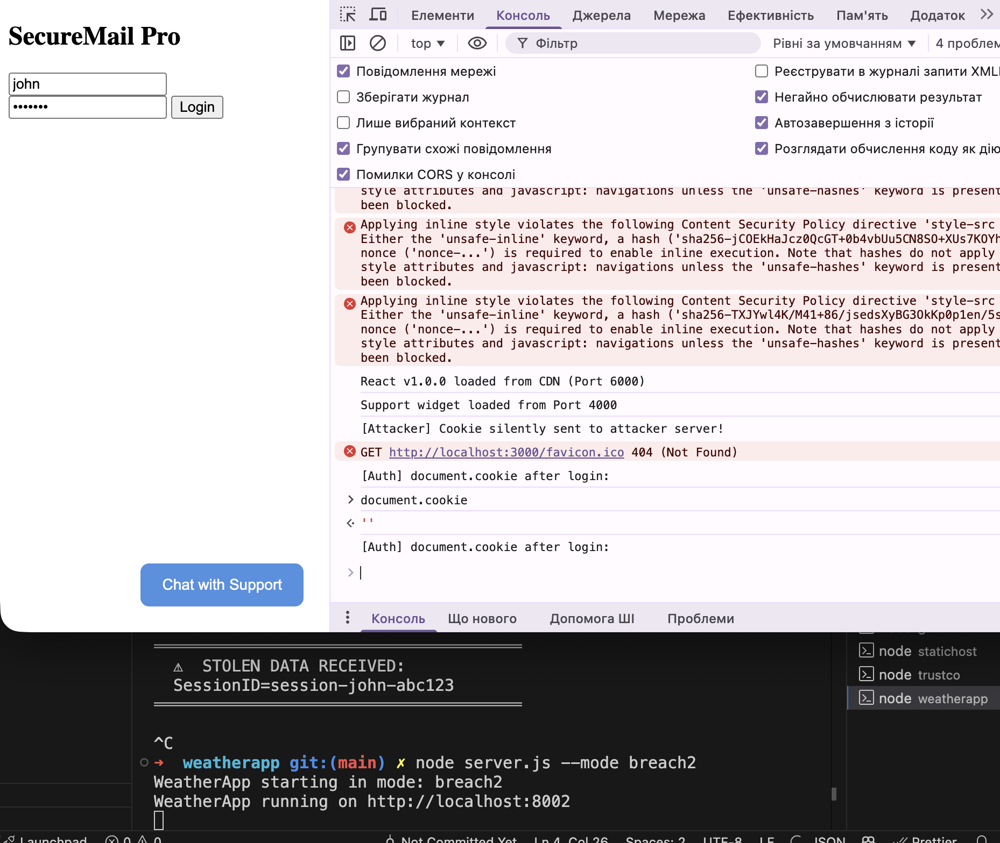

### Task 4 — Path Restriction
Cookie scoped to `Path=/api`. Sent only to `/api/*` routes, not to the root path.

Cookie present on `/api/emails`:  


Cookie absent on `/`:  


---

## Lab 5 — Network Security & MitM Attack

**Concept:** The `Secure` flag and protection against network-level interception.

### Task 1 — MitM Proxy Intercepts HttpOnly Cookie
A proxy server sits between browser and app. Even with `HttpOnly` set,  
the proxy reads raw HTTP headers and logs the session token in plain text.

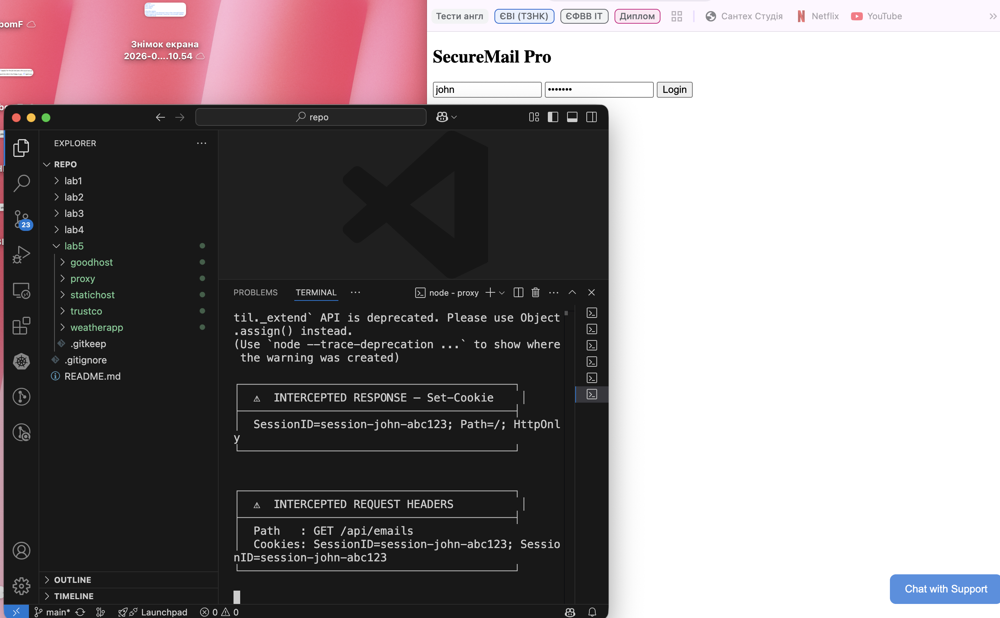

### Task 2 — Secure Flag
Adding `Secure` to the cookie instructs the browser to only send it over HTTPS.  
Over plain HTTP (via the proxy), the cookie is withheld by the browser.  
Note: Chrome makes a localhost exception, but the `Set-Cookie` header confirms the flag is set.

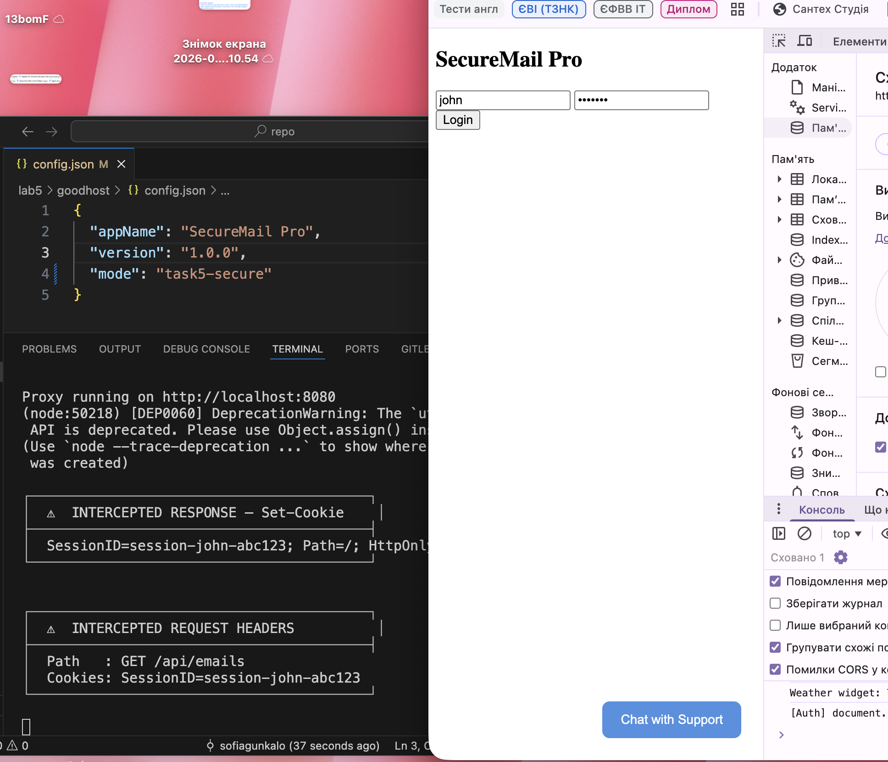

---

## Cookie Security Summary

| Lab | Mode | Flags | Attack Result |
|-----|------|-------|---------------|
| Lab 4 Task 1 | `task1-naive` | none | Cookie stolen via JS |
| Lab 4 Task 2 | `task1-naive` | none | Cookie silently exfiltrated |
| Lab 4 Task 3 | `task3-httponly` | `HttpOnly` | JS theft prevented |
| Lab 4 Task 4 | `task4-path` | `HttpOnly; Path=/api` | Scope limited |
| Lab 5 Task 1 | `task5-httponly` | `HttpOnly` | MitM still works |
| Lab 5 Task 2 | `task5-secure` | `HttpOnly; Secure` | MitM prevented |

## How to Run

```bash
# Install dependencies in each server folder
cd labN/goodhost && npm install
cd labN/statichost && npm install
cd labN/trustco && npm install
cd labN/weatherapp && npm install

# Start servers (4 terminals)
node server.js                    # goodhost (port 3000)
node server.js                    # statichost (port 8001)
node server.js                    # trustco (port 4000)
node server.js --mode breach1     # weatherapp (port 8002)

# Lab 5 only — proxy
cd lab5/proxy && npm install
node server.js --mode breach      # proxy (port 8080)
```